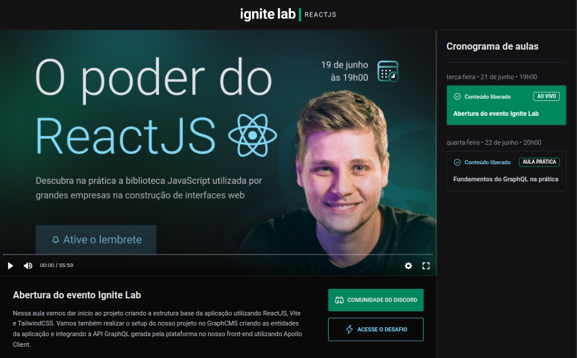

<h1 align="center">Event Platform</h1>
<p align="center">React application developed during Ignite Lab (Rocketseat)</p>


## About
<p align="justify">Event Platform is a ReactJS application that consumes data from a GraphQL API.</p>
<h3>Features:</h3>
<ul>
<li>Subscription</li>
<li>List of lessons</li>
<li>Youtube embedded player</li>
</ul>


## Technologies
This applications's been developed using the following technologies:
- <a href="https://www.typescriptlang.org/">Typescript</a>
- <a href="https://reactjs.org/">ReactJS</a>
- <a href="https://vitejs.dev/">Vitejs</a>
- <a href="https://tailwindcss.com/">Tailwind CSS</a> 
- <a href="https://graphcms.com/">GraphCMS</a>
- <a href="https://graphql.org/">GraphQL</a>
- <a href="https://www.apollographql.com/docs/">Apollo</a>
- <a href="https://www.graphql-code-generator.com/">GraphQL Code Generator</a>
- <a href="https://vimejs.com/">Vime</a>
- <a href="https://www.npmjs.com/package/classnames">Lib classnames</a>


## Getting started
### Requisites
```bash

# Install all dependencies:
$ npm install

# Start application:
$ npm run dev
```

## Screenshots
 <div align="center">
  
</div>

## Author
This project's been developed by <a href="https://www.linkedin.com/in/bruno-yamaguchi/">Bruno Yamaguchi</a> during Ignite Lab from Rocketseat.
